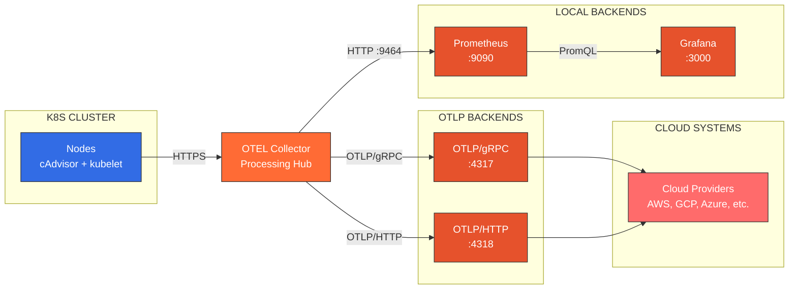
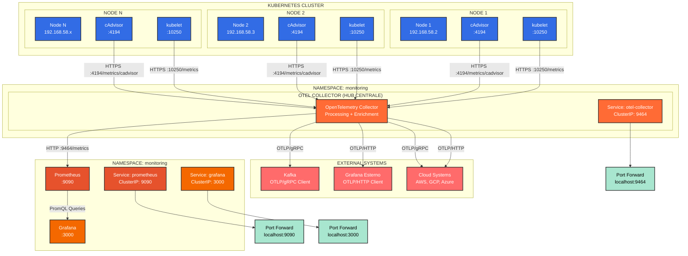

# Sistema di Monitoring Kubernetes con OpenTelemetry

## Panoramica

Questo progetto implementa un sistema di monitoring completo per cluster Kubernetes utilizzando **OpenTelemetry Collector** come hub centrale per la raccolta e distribuzione delle metriche.

## Architettura del Sistema

### Diagramma Compatto (Overview)

## Porte e Protocolli

| Componente | Porta Interna | Porta Esterna | Protocollo | Scopo |
|------------|----------------|----------------|------------|-------|
| **cAdvisor** | `:4194` | - | HTTPS | Metriche container |
| **kubelet** | `:10250` | - | HTTPS | Metriche nodo |
| **OTEL Collector** | `:9464` | `localhost:9464` | HTTP | API metriche |
| **Prometheus** | `:9090` | `localhost:9090` | HTTP | UI + API |
| **Grafana** | `:3000` | `localhost:3000` | HTTP | Dashboard |
| **OTLP/gRPC** | - | - | gRPC | Export verso Kafka |
| **OTLP/HTTP** | - | - | HTTP | Export verso SigNoz |

## Diagramma Architetturale Completo

---

## Flusso dei Dati Completo

### **1. Raccolta Metriche (Sources)**
- **cAdvisor** su ogni nodo espone metriche su `:4194/metrics/cadvisor`
- **kubelet** su ogni nodo espone metriche su `:10250/metrics`
- **OpenTelemetry Collector** raccoglie queste metriche via HTTPS

### **2. Elaborazione (Processing)**
- **OTEL Collector** standardizza e processa le metriche
- **Batch processing** per ottimizzazione
- **Memory limiting** per gestione risorse
- **Relabeling** per organizzazione dati

### **3. Esportazione (Export)**
- **OTEL Collector** espone metriche su `:9464/metrics` per Prometheus
- **OTEL Collector** esporta metriche via OTLP/gRPC verso Kafka
- **OTEL Collector** esporta metriche via OTLP/HTTP verso SigNoz
- **Prometheus** memorizza e fornisce API query su `:9090`

### **4. Visualizzazione (Visualization)**
- **Grafana** si connette a Prometheus per query
- **Grafana** espone dashboard su `:3000`
- **Port forwarding** per accesso esterno
